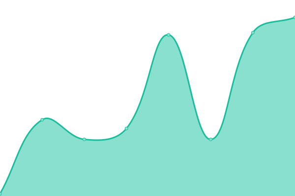

# [📈 Live Status](https://status.bentleyherron.com): <!--live status--> **🟩 All systems operational**

This repository contains the open-source uptime monitor and status page for [Bentley Herron](bentleyherron.com), powered by [Upptime](https://github.com/upptime/upptime).

With [Upptime](https://upptime.js.org), you can get your own unlimited and free uptime monitor and status page, powered entirely by a GitHub repository. We use [Issues](https://github.com/bentleyherron/uptime/issues) as incident reports, [Actions](https://github.com/bentleyherron/uptime/actions) as uptime monitors, and [Pages](https://status.bentleyherron.com) for the status page.

<!--start: status pages-->
<!-- This summary is generated by Upptime (https://github.com/upptime/upptime) -->
<!-- Do not edit this manually, your changes will be overwritten -->
<!-- prettier-ignore -->
| URL | Status | History | Response Time | Uptime |
| --- | ------ | ------- | ------------- | ------ |
|  [Personal Website](https://bentleyherron.com) | 🟩 Up | [personal-website.yml](https://github.com/bentleyherron/uptime/commits/master/history/personal-website.yml) | 

 207ms
     
 | 

<a href="https://status.bentleyherron.com/history/personal-website">100.00%</a>
    

|  [Jeopardy Game](https://jeopardy.bentleyherron.dev) | 🟩 Up | [jeopardy-game.yml](https://github.com/bentleyherron/uptime/commits/master/history/jeopardy-game.yml) | 

 176ms
     
 | 

<a href="https://status.bentleyherron.com/history/jeopardy-game">100.00%</a>
    

|  [Jeopardy API](https://jeopardy-api.bentleyherron.dev) | 🟩 Up | [jeopardy-api.yml](https://github.com/bentleyherron/uptime/commits/master/history/jeopardy-api.yml) | 

 190ms
     
 | 

<a href="https://status.bentleyherron.com/history/jeopardy-api">100.00%</a>
    

|  [Jeopardy API Docs](https://jeopardy-api.bentleyherron.dev) | 🟩 Up | [jeopardy-api-docs.yml](https://github.com/bentleyherron/uptime/commits/master/history/jeopardy-api-docs.yml) | 

 36ms
     
 | 

<a href="https://status.bentleyherron.com/history/jeopardy-api-docs">100.00%</a>
    

|  [Matchga.me](https://matchga.me) | 🟩 Up | [matchga-me.yml](https://github.com/bentleyherron/uptime/commits/master/history/matchga-me.yml) | 

 179ms
     
 | 

<a href="https://status.bentleyherron.com/history/matchga-me">100.00%</a>
    

|  Matchga.me API | 🟩 Up | [matchga-me-api.yml](https://github.com/bentleyherron/uptime/commits/master/history/matchga-me-api.yml) | 

 213ms
     
 | 

<a href="https://status.bentleyherron.com/history/matchga-me-api">100.00%</a>
    

<!--end: status pages-->

[**Visit our status website →**](https://status.bentleyherron.com)

## 📄 License

- Powered by: [Upptime](https://github.com/upptime/upptime)
- Code: [MIT](./LICENSE) © [Bentley Herron](bentleyherron.com)
- Data in the `./history` directory: [Open Database License](https://opendatacommons.org/licenses/odbl/1-0/)
